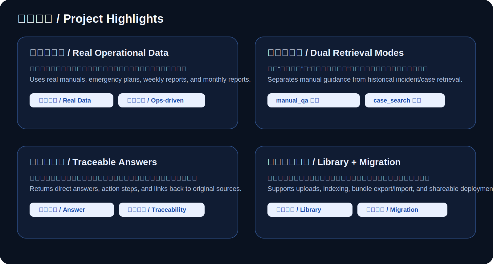
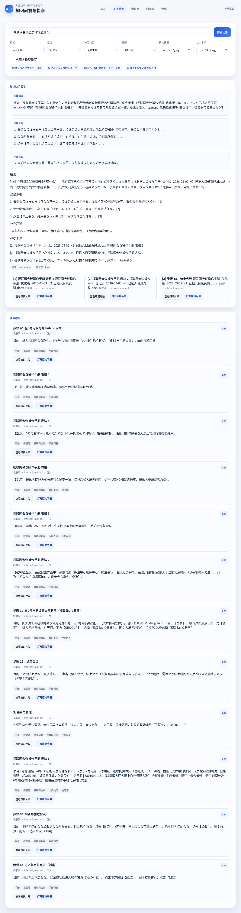
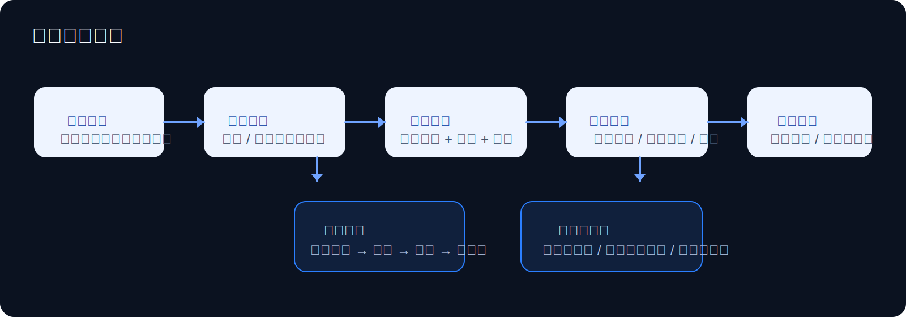
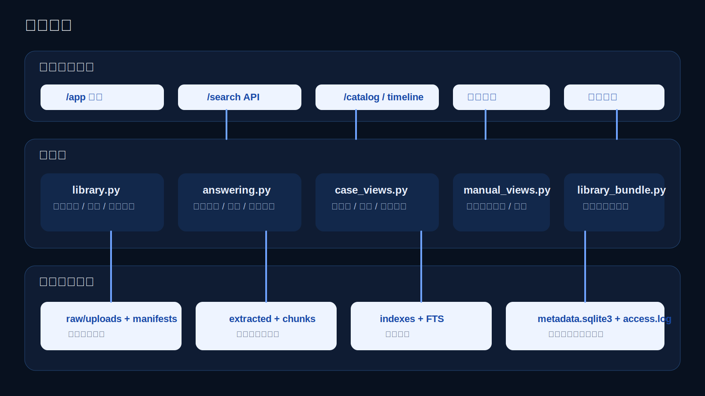

# 政企运维知识库问答助手

面向政企驻场运维场景的知识库问答系统。  
项目目标不是只做“文档搜索”，而是把分散在操作手册、应急预案、周报、月报中的资料整理成一个可上传、可检索、可问答、可追溯、可迁移的运维知识助手。

## English Summary

Knowledge-base assistant for government-enterprise onsite IT operations.

- Ingests manuals, emergency plans, weekly reports, and monthly reports
- Supports document upload, indexing, hybrid retrieval, cited answers, and case replay
- Designed as more than a search tool: it returns direct answers, action steps, and traceable sources
- Tech focus: Python, FastAPI, SQLite FTS, TF-IDF retrieval, RAG-style answering, local deployment and migration

## 项目定位

这个项目解决的是运维现场常见的 4 个问题：

- 资料分散，查手册慢
- 同类故障反复出现，历史案例难复用
- 新资料加入后，人工整理成本高
- 项目迁移到新电脑或服务器时，数据和索引难搬迁

我把这些问题做成了一个完整系统，而不只是一个检索脚本。

## 项目亮点卡片 / Bilingual Highlight Cards



## 首页图示

### 知识问答页面截图



### 问答链路流程图



### 系统架构图



## 现在已经能做什么

- 支持 `docx / pdf / xlsx / txt` 导入
- 支持资料库手动上传、保存、分类、标签管理
- 支持增量索引与全量重建
- 支持 `手册问答 / 历史案例检索` 双模式
- 支持混合检索  
  `SQLite FTS + TF-IDF`
- 支持答案生成、建议步骤、补充建议
- 支持引用来源回溯、手册章节详情、案例详情
- 支持案例时间轴与专题复盘
- 支持资料导出、分析统计
- 支持迁移包 ZIP 导入 / 导出
- 支持共享启动、管理员认证、访问日志

## 为什么它不是普通搜索工具

这个项目的目标不是“把原文段落扔给用户”，而是：

1. 先给用户可直接使用的回答
2. 再给处理步骤
3. 最后提供手册或案例来源，保证可追溯

也就是：

```text
用户提问
-> 检索相关手册 / 案例
-> 归纳成直接回答
-> 返回步骤和补充建议
-> 支持回看原始资料
```

## 核心亮点

### 1. 真实运维资料驱动

知识源不是虚构数据，而是来自真实场景的：

- 操作手册
- 应急预案
- 周报
- 月报

所以它能回答的是“真实运维问题”，不是泛泛聊天。

### 2. 双模式知识检索

- `manual_qa`：偏操作手册和应急预案
- `case_search`：偏历史问题和处理记录

这让“怎么操作”和“以前怎么处理过”可以分开检索。

### 3. 资料库管理和迁移能力

项目不仅能问答，还能管理资料生命周期：

- 上传并入库
- 自动索引
- 导出分析
- 打包迁移
- 新机器恢复

### 4. 可共享、可部署

已经支持：

- 本地启动
- 局域网共享
- 外置数据目录
- systemd / Docker 部署

## 技术栈

- Python
- FastAPI
- SQLite
- SQLite FTS
- TF-IDF 检索
- 文档解析
- RAG 基础链路
- Jinja2 + 自定义管理界面

## 系统结构

- `app/core/`：配置、权限、访问日志
- `app/ingestion/`：文档解析、切块、标签化
- `app/retrieval/`：混合检索与索引构建
- `app/services/`：问答、案例、资料库、迁移服务
- `app/web/`：页面路由
- `app/templates/`：前端模板
- `scripts/`：索引、验收、迁移、启动脚本
- `tests/`：自动化回归测试

## 快速开始

### 1. 安装依赖

```bash
uv venv
uv pip install -p .venv/bin/python -e '.[dev]'
```

### 2. 启动本地服务

```bash
cp .env.example .env
./scripts/start_local.sh
```

### 3. 打开页面

- 总览：`/app`
- 问答检索：`/app/search`
- 资料库：`/app/library`
- 时间轴：`/app/timeline`
- 专题视图：`/app/topics`

## 共享与迁移

### 让别人也能访问

```bash
OPS_ASSISTANT_HOST=0.0.0.0
OPS_ASSISTANT_PORT=8000
OPS_ASSISTANT_REQUIRE_AUTH=true
./scripts/start_shared.sh
```

### 迁移到其他电脑或服务器

```bash
.venv/bin/python scripts/manage_library.py bundle-export --output /tmp/ops-assistant-bundle.zip
.venv/bin/python scripts/manage_library.py bundle-import --input /tmp/ops-assistant-bundle.zip
```

## 测试与验收

### 自动化测试

```bash
.venv/bin/python -m unittest discover -s tests -p 'test_*.py' -v
```

### 本机全功能验收

```bash
.venv/bin/python scripts/run_local_machine_validation.py
```

这个项目已经做过：

- 自动化回归测试
- 本机前后端联调
- 上传、检索、导出、重建、认证链路验收
- 迁移包导出 / 导入恢复验证

## 适合面试讲解的点

- 这不是单纯的 RAG demo，而是带资料管理、可追溯问答、可迁移能力的完整小系统
- 项目把运维经验、知识整理、Python 后端和 AI 应用结合在一起
- 更像“真实工作场景里的内部工具产品”，而不是单页实验项目

## 公开仓库说明

这是用于展示项目能力的公开仓库版本，已移除：

- 本地资料库数据
- 上传资料原件
- 检索索引
- 访问日志
- `.env` 和本地配置

## 相关文档

- [docs/共享部署与迁移手册.md](docs/共享部署与迁移手册.md)
- [docs/部署与运维手册.md](docs/部署与运维手册.md)
- [docs/落地验收报告.md](docs/落地验收报告.md)
- [docs/本机全功能测试报告.md](docs/本机全功能测试报告.md)
